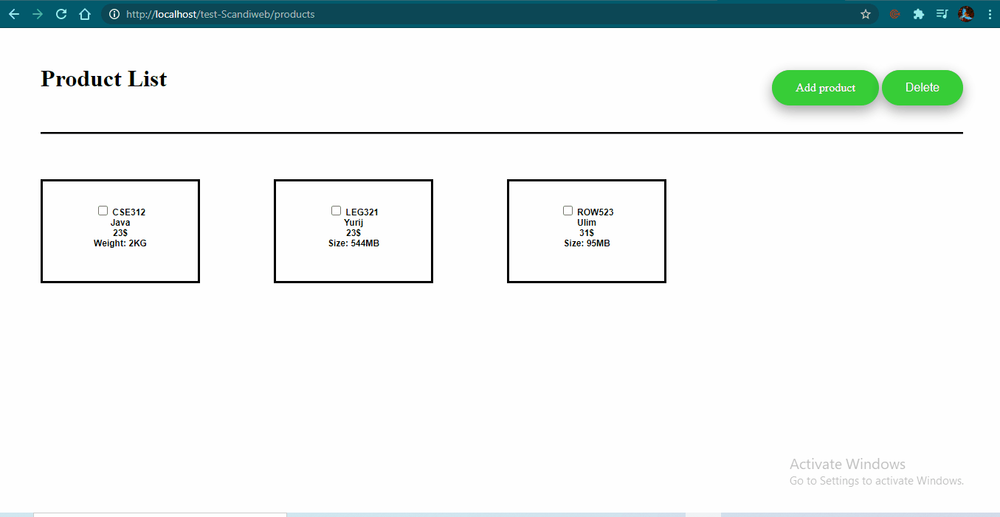

## Example

## About application
From scratch <strong>MVC</strong> pattern was created for the application. The application have two pages only "products" and "createProduct". User can create products which will be stored to <strong>MySQL</strong> database. User can massively delete products as well, which will remove the product from database.
## Used
<ul>
  <li><strong>Plain classes, OOP PHP 7.4</strong></li>
  <li><strong>Plain JavaScript</strong> is used to manipulate dependable product type sellection</li>
  <li><strong>SASS</strong></li>
  <li><strong>MySQL</strong></li>
</ul>

## Instalation
First place the application folders to your localhost server e.g. XAMPP or WAMP.  
Following, modify the <strong>config.php</strong> file depending your localhost database and table.
Thirdly, create columns in your database table like it is indicated in the e.g. <strong>ProductsController.php</strong> file
